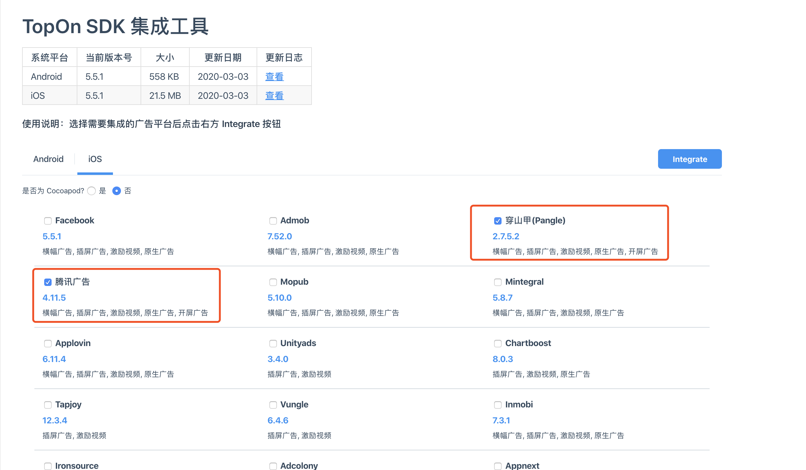

# React Native Integration Guide

## 1. Introduction

This document contains the following contents:
1. Account apply, app and placement creation
2. TopOn SDK integration 

Currently TopOn SDK for React Native supports the following formats:

| Format | Note |
| ---- | ---- |
| Rewarded Video | UI provided |
| Interstitial | UI provided |
| Banner | UI provided |

## 2. Account and ID Apply

You can abtain accounts and ids via <a href="https://docs.toponad.com/#/en-us/reactnative/GetStarted/TopOn_Get_Started" target="_blank">TonOn's website</a>

## 3. SDK Import

### 3.1 Import the SDK into Your Project

**AnyThinkSDK for React Native** contains the following modules, you can import parts of it or all of it into your project according to your need. <a href="https://docs.toponad.com/#/en-us/reactnative/reactnative_doc/release_note" target="_blank">Get TopOn SDK</a> **(Note: ReactNative SDK needs to be used with Android or iOS SDK)**

Contents of the root directory

| Folder | Desc |
| ---- | ---- |
| Android | Android dependency|
| iOS | iOS dependency |
| Android_iOS | Foundation dependency for both iOS and Android |

Platform specific folder contents

| Folder | Desc |
| ---- | ---- |
| Scipt | To be imported into React Native |
| bridge/iOS | To be imported into the xcode project generated with React Native |
| bridge/Andorid | To be imported into the Android Studio project generated with React Native |

**Note: Before performing the following steps, please configure the environment necessary for React Native**

#### 3.1.1 Android Specific Note

1. Select the **anythink_reactnativejs_bridge.aar** package under the Android platform in the SDK compressed package and put it in **the libs directory** of the project project, and introduce it through **build.gradle**

   ```
   dependencies {
   	api fileTree(include: ['*.jar','*.aar'], dir: 'libs')
   }
   ```

   You can also choose the source code method and place the source code in the **src/main/java directory** of the project. At this time, you need to configure additional obfuscation rules:

   ```
   -keep public class com.anythink.reactnativejs.**
   -keepclassmembers class com.anythink.reactnativejs.** {
      public *;
   }
   ```

   Then add the following code in Application:

   ```
   public class MainApplication extends Application implements ReactApplication {
   
     private final ReactNativeHost mReactNativeHost =
         new ReactNativeHost(this) {
           ···
           @Override
           protected List<ReactPackage> getPackages() {
             List<ReactPackage> packages = new PackageList(this).getPackages();
             // Packages that cannot be autolinked yet can be added manually here, for example:
             // packages.add(new MyReactNativePackage());
             packages.add(new ATReactNativeBridgePackage());//Add this line of code
             return packages;
           }
           ···
         };
   
     @Override
     public ReactNativeHost getReactNativeHost() {
       return mReactNativeHost;
     }
   }
   ```

2. Go to <a href="https://docs.toponad.com/#/en-us/android/download/package" target="_blank">Topon's website</a>, select the network you need and download the sdk package, which you can unzip after the download finishes. Please refer to <a href="https://docs.toponad.com/#/en-us/android/android_doc/android_access_doc?id=_2-import-the-topon-sdk" target="_blank">Android SDK Import Guide</a> for more info on how to import this package, including guide for libs, AndroidManifest import and other info.

#### 3.1.2 iOS Specific Note

1. Drag&Drop the **iOSReactNativeBridge** folder(which you can find in the package we released.) into your xcode project, configure the popup as follows:
1) Check **Copy items if needed** for **Destination**
2) Check **Create groups** for **Added Folders**
3) Check the target you would like to integrate the sdk for **Add to targets**
see the picture below:

2. Go to <a href="https://docs.toponad.com/#/en-us/ios/download/package" target="_blank">Topon's website</a> , select the networks you would like to integrate and download the sdk; when the download finishes unzip the package and drag&drop **all the frameworks & bundles** into xcode:

3. Please ensure that the imported sdk version is **5.7.0** or higher.
4. After configuring the ReactNative environment, cd to the project root directory (which containing the package.json file), and execute the command **npm install** to install node_modules.
5. After the installation is successful, open the iOS project directory ( the directory containing the Podfile file, if not, refer to the Podfile in the demo project), and execute the command **pod install**.
6. If you encounter any compile error, please refer to  <a href="https://docs.toponad.com/#/en-us/ios/ios_doc/ios_errorcode" target="_blank">FAQ</a> for solutions. please feel free to contact us for any problem.

**Note:** Code segments are extracted from our <a href="https://github.com/anythinkteam/demo_reactnative" target="_blank">demo project</a>

## 4 SDK Initialization

Use the following code segment to init **AnyThinkSDK**

```java
//declare the module
import {
    ATRNSDK
} from './AnyThinkAds/ATReactNativeSDK';

//Enable the SDK debug log. It is strongly recommended to enable it during the testing phase to facilitate troubleshooting
ATRNSDK.setLogDebug(true);

//Get SDK version
ATRNSDK.getSDKVersionName().then(versionName => {
    console.log('TopOn SDK version name: ' + versionName);
});

//Only for Android
if (Platform.OS === 'android') {
    //Determine whether it is the Chinese version of the SDK
    ATRNSDK.isChinaSDK().then(isChinaSDK => {
        console.log('isChinaSDK: ' + isChinaSDK);
    });
}

//Set a list of excluded package names for cross promotion, the products corresponding to the excluded package names will not be promoted anymore
ATRNSDK.setExcludeMyOfferPkgList(
    [
        "com.exclude.myoffer1",
        "com.exclude.myoffer2",
    ]
);

//Custom maps are used for segment matching
var customMap = {
    "appCustomKey1": "appCustomValue1",
    "appCustomKey2" : "appCustomValue2"
};

//Configure custom map for the app
ATRNSDK.initCustomMap(customMap);


var customPlacementId = "";
if (cc.sys.os === cc.sys.OS_IOS) {   
    customPlacementId = "b5b72b21184aa8";
} else if (cc.sys.os === cc.sys.OS_ANDROID) {
    customPlacementId = "b5b449fb3d89d7";
}

//Configure custom map for the placement
var placementCustomMap = {
    "placementCustomKey1": "placementCustomValue1",
    "placementCustomKey2" : "placementCustomValue2"
};
ATRNSDK.setPlacementCustomMap(customPlacementId, placementCustomMap);

// Configure data consent
// ATRNSDK.PERSONALIZED（allow data collection）
// ATRNSDK.NONPERSONALIZED（disallow data collection）
// ATRNSDK.setGDPRLevel(ATRNSDK.PERSONALIZED); 

// Get data consent
var GDPRLevel = ATJSSDK.getGDPRLevel();

// Init the sdk
ATRNSDK.initSDK("a5aa1f9deda26d", "4f7b9ac17decb9babec83aac078742c7");

// GDPR configuration for EU
ATRNSDK.getUserLocation().then(userLocation => {
    console.log('userLocation: ' + userLocation);
    //Present the dislog in EU if user has never granted data consent
    if (userLocation == ATRNSDK.kATUserLocationInEU) {
        console.log('userLocation: in EU');
        ATRNSDK.getGDPRLevel().then((level) => {
            console.log('gdpr level: ' + level);
            if (level == ATRNSDK.UNKNOWN) {
                ATRNSDK.showGDPRAuth();
            }
        })
    } else {
        console.log('userLocation: not in EU');
    }
})

```

## 5. Rewarded Video Ad

Import rewarded video module.

```java
import {
    ATRewardedVideoRNSDK
} from './AnyThinkAds/ATReactNativeSDK';
```

### 5.1 Load Rewarded Video

Use the following code to load rewarded video:

```JavaScript
var setting = {};
//If you need to distribute rewards through the developer's server (some advertising platforms support this server incentive), you need to pass the following two keys
//ATRewardedVideoJSSDK.userIdKey must be transmitted, used to identify each user; ATRewardedVideoJSSDK.userDataKey is an optional parameter, after being passed in, it will be transparently transmitted to the developer's server
settings[ATRewardedVideoRNSDK.userIdKey] = "test_user_id";
settings[ATRewardedVideoRNSDK.userDataKey] = "test_user_data";
ATRewardedVideoRNSDK.loadAd(this.rewardedVideoPlacementId, settings);
```

### 5.2 Determine whether there is an ad cache and get the ad status

Use the following code to determine whether there is an ad cache:

```
ATRewardedVideoRNSDK.hasAdReady(this.rewardedVideoPlacementId);
```

Use the following code to get the status of the advertisement (the return value type is a Json string):

```
ATRewardedVideoRNSDK.checkAdStatus(this.rewardedVideoPlacementId);
```

Advertising status Json string key-value is as follows:

1. **isLoading**: whether it is loading

2. **isReady**: Is there any advertisement cache

3. **adInfo**: current ad cache information with the highest priority

### 5.3 Show Rewarded Video

Use the following code to show rewarded video:

```JavaScript
ATRewardedVideoRNSDK.showAd(this.rewardedVideoPlacementId);

//When using the scene function, display through this api
//ATRewardedVideoRNSDK.showAdInScenario(this.rewardedVideoPlacementId, this.rewardedVideoScenarioId);
```

**Note:** the scenario parameter here can be obtained from Topon developer's website.

### 5.4 Implement Rewarded Video Listener

Implement rewarded video listener as follows: **(The same event can only be set once globally. You can get the ad slot ID corresponding to this event through event.placementId, event.adCallbackInfo to get the callbackInfo of this event, and event.errorMsg to get the error information)**:

```JavaScript
//ad loaded successfully
ATRewardedVideoRNSDK.setAdListener(ATRewardedVideoRNSDK.onRewardedVideoLoaded, (event) => {
	console.log('ATRewardedVideoLoaded: ' + event.placementId);
});
//ad loading failed
ATRewardedVideoRNSDK.setAdListener(ATRewardedVideoRNSDK.onRewardedVideoFail, (event) => {
    console.warn('ATRewardedVideoLoadFail: ' + event.placementId + ', errorMsg: ' + event.errorMsg);
});
//ad video starts playing
ATRewardedVideoRNSDK.setAdListener(ATRewardedVideoRNSDK.onRewardedVideoPlayStart, (event) => {
    console.log('ATRewardedVideoPlayStart: ' + event.placementId + ', adCallbackInfo: ' + event.adCallbackInfo);
});
//ad video ends
ATRewardedVideoRNSDK.setAdListener(ATRewardedVideoRNSDK.onRewardedVideoPlayEnd, (event) => {
    console.log('ATRewardedVideoPlayEnd: ' + event.placementId + ', adCallbackInfo: ' + event.adCallbackInfo);
});
//ad video failed to play
ATRewardedVideoRNSDK.setAdListener(ATRewardedVideoRNSDK.onRewardedVideoPlayFail, (event) => {
    console.log('ATRewardedVideoPlayFail: ' + event.placementId + ', errorMsg: ' + event.errorMsg + ', adCallbackInfo: ' + event.adCallbackInfo);
});
//ad video was clicked
ATRewardedVideoRNSDK.setAdListener(ATRewardedVideoRNSDK.onRewardedVideoClick, (event) => {
    console.log('ATRewardedVideoClick: ' + event.placementId + ', adCallbackInfo: ' + event.adCallbackInfo);
});
//the incentive is successful, the developer can issue a reward in this callback, generally before the onRewardedVideoAdPlayClosed callback, and the server incentive is not necessarily
ATRewardedVideoRNSDK.setAdListener(ATRewardedVideoRNSDK.onRewardedVideoReward, (event) => {
    console.log('ATRewardedVideoReward: ' + event.placementId + ', adCallbackInfo: ' + event.adCallbackInfo);
});
//ad video is closed
ATRewardedVideoRNSDK.setAdListener(ATRewardedVideoRNSDK.onRewardedVideoClose, (event) => {
    console.log('ATRewardedVideoClose: ' + event.placementId + ', adCallbackInfo: ' + event.adCallbackInfo);
});
```

Please refer to [demo project](https://github.com/anythinkteam/demo_reactnative) for more infomation.

### 5.5 Remove the listener for the Rewarded Video

When not needed, you can remove event listeners

```
ATRewardedVideoRNSDK.removeAllListeners();
```

## 6. Interstitial Ad

Import interstitial ad module

```java
import {
    ATInterstitialRNSDK
} from './AnyThinkAds/ATReactNativeSDK';
```

### 6.1 Load Interstitial Ad

Use the following code to load interstitial ad

```JavaScript
var settings = {};
only for Sigmob platform, Sigmob's rewarded video ad source is used as interstitial
//settings[ATInterstitialRNSDK.UseRewardedVideoAsInterstitial] = true;
settings[ATInterstitialRNSDK.UseRewardedVideoAsInterstitial] = false;

ATInterstitialRNSDK.loadAd(this.interstitialPlacementId, settings);
```

### 6.2 Determine whether there is an ad cache and get the ad status

Use the following code to determine whether there is an ad cache:

```
ATInterstitialRNSDK.hasAdReady(this.interstitialPlacementId);
```

Use the following code to get the status of the advertisement (the return value type is a Json string):

```
ATInterstitialRNSDK.checkAdStatus(this.interstitialPlacementId);
```

Advertising status Json string key-value is as follows:

1. **isLoading**: whether it is loading

2. **isReady**: Is there any advertisement cache

3. **adInfo**: current ad cache information with the highest priority

### 6.3 Show Interstitial Ad

Use the following code to show interstitial ad

```JavaScript
ATInterstitialRNSDK.showAd(this.interstitialPlacementId);

//When using the scene function, display through this api
//ATInterstitialRNSDK.showAdInScenario(this.interstitialPlacementId, this.interstitialScenarioId);
```

**Note:** the scenario parameter here can be obtained from Topon developer's website.

### 6.4 Implement Interstitial Listener

Implement interstitial listener as follows: **(The same event can only be set once globally. You can get the ad slot ID corresponding to this event through event.placementId, event.adCallbackInfo to get the callbackInfo of this event, and event.errorMsg to get the error information)**:

```JavaScript
//ad loaded successfully
ATInterstitialRNSDK.setAdListener(ATInterstitialRNSDK.onInterstitialLoaded, (event) => {
    console.log('ATInterstitialLoaded: ' + event.placementId);
});
//ad loading failed
ATInterstitialRNSDK.setAdListener(ATInterstitialRNSDK.onInterstitialFail, (event) => {
    console.warn('ATInterstitialLoadFail: ' + event.placementId + ', errorMsg: ' + event.errorMsg);
});
//ad displayed successfully
ATInterstitialRNSDK.setAdListener(ATInterstitialRNSDK.onInterstitialAdShow, (event) => {
    console.log('ATInterstitialAdShow: ' + event.placementId + ', adCallbackInfo: ' + event.adCallbackInfo);
});
//ad video starts to play, some advertising platforms have this callback
ATInterstitialRNSDK.setAdListener(ATInterstitialRNSDK.onInterstitialPlayStart, (event) => {
    console.log('ATInterstitialPlayStart: ' + event.placementId + ', adCallbackInfo: ' + event.adCallbackInfo);
});
//ad video playback ends, some advertising platforms have this callback
ATInterstitialRNSDK.setAdListener(ATInterstitialRNSDK.onInterstitialPlayEnd, (event) => {
    console.log('ATInterstitialPlayEnd: ' + event.placementId + ', adCallbackInfo: ' + event.adCallbackInfo);
});
//ad video playback failed, some advertising platforms have this callback
ATInterstitialRNSDK.setAdListener(ATInterstitialRNSDK.onInterstitialPlayFail, (event) => {
    console.log('ATInterstitialPlayFail: ' + event.placementId + ', errorMsg: ' + event.errorMsg + ', adCallbackInfo: ' + event.adCallbackInfo);
});
//ad was clicked
ATInterstitialRNSDK.setAdListener(ATInterstitialRNSDK.onInterstitialClick, (event) => {
    console.log('ATInterstitialClick: ' + event.placementId + ', adCallbackInfo: ' + event.adCallbackInfo);
});
//ad was closed
ATInterstitialRNSDK.setAdListener(ATInterstitialRNSDK.onInterstitialClose, (event) => {
    console.log('ATInterstitialClose: ' + event.placementId + ', adCallbackInfo: ' + event.adCallbackInfo);
});
```

Please refer to [demo project](https://github.com/anythinkteam/demo_reactnative) for more infomation.

### 6.5 Remove the listener for the Interstitial

When not needed, you can remove event listeners

```
ATInterstitialRNSDK.removeAllListeners();
```

## 7. Banner Ad

Import banner module

```java
import {
    ATBannerRNSDK
} from './AnyThinkAds/ATReactNativeSDK';
```

### 7.1 Load Banner Ad

Use the following code to load banner ad

```JavaScript
var settings = {};
if (Platform.OS === 'android') {
  settings[ATBannerRNSDK.kATBannerAdLoadingExtraBannerAdSizeStruct] = ATBannerRNSDK.createLoadAdSize(this.deviceWidthInPixel, this.deviceWidthInPixel * 50/320);
  
  //only for Admob Adaptive Banner
  settings[ATBannerRNSDK.kATBannerAdAdaptiveWidth] = this.deviceWidthInPixel;
  settings[ATBannerRNSDK.kATBannerAdAdaptiveOrientation] = ATBannerRNSDK.kATBannerAdAdaptiveOrientationCurrent;
//    settings[ATBannerRNSDK.kATBannerAdAdaptiveOrientation] = ATBannerRNSDK.kATBannerAdAdaptiveOrientationPortrait;
//    settings[ATBannerRNSDK.kATBannerAdAdaptiveOrientation] = ATBannerRNSDK.kATBannerAdAdaptiveOrientationLandscape;
} 
else if (Platform.OS === 'ios') {
  // The incoming banner size is subject to pt
  settings[ATBannerRNSDK.kATBannerAdLoadingExtraBannerAdSizeStruct] = ATBannerRNSDK.createLoadAdSize(320, 50);
  
  //only for Admob Adaptive Banner
  settings[ATBannerRNSDK.kATBannerAdAdaptiveWidth] = 320;
  settings[ATBannerRNSDK.kATBannerAdAdaptiveOrientation] = ATBannerRNSDK.kATBannerAdAdaptiveOrientationCurrent;
//    settings[ATBannerRNSDK.kATBannerAdAdaptiveOrientation] = ATBannerRNSDK.kATBannerAdAdaptiveOrientationPortrait;
//    settings[ATBannerRNSDK.kATBannerAdAdaptiveOrientation] = ATBannerRNSDK.kATBannerAdAdaptiveOrientationLandscape;
}

ATBannerRNSDK.loadAd(this.bannerPlacementId, settings);
```

**Note on ATBannerRNSDK.createLoadAdSize(width, height) method**

- width：Banner's width
- height：Banner's height

**Note:** you have to pass this parameter when loading banner ad.

### 7.2 Show Banner Ad

You can show banner in one of the following two ways

#### 7.2.1 Use Predefined Positions

1) Show banner on top of the screen

```JavaScript
ATBannerRNSDK.showAdInPosition(this.bannerPlacementId, ATBannerRNSDK.kATBannerAdShowingPositionTop)
```

2）Show banner on the bottom of the screen

```JavaScript
ATBannerRNSDK.showAdInPosition(this.bannerPlacementId, ATBannerRNSDK.kATBannerAdShowingPositionBottom);
```

When predefined position is being used, safe area issues will be taken into account by AnyThinkSDK.

#### 7.2.2 Use Coordinate

```JavaScript
ATBannerRNSDK.showAdInRectangle(this.bannerPlacementId,  ATBannerRNSDK.createShowAdRect(0, 0, this.deviceWidthInPixel, this.deviceWidthInPixel  * 50/320))
```

**Notes on ATBannerRNSDK.createShowAdRect(x, y, width, height)**<br>
（1）x:The distance of the left edge of the banner and the left edge of the screen<br>
（2）y:The distance of the top edge of the banner and the top of the screen<br>
（3）width: banner's width <br>
（4）height: banner's height <br>

##### **About the width and height settings**

By using **Dimensions.get('window').width * Dimensions.get('window').scale** or **Dimensions.get('window').height * Dimensions.get('window'). Scale** to obtain the width and height pixel values of the screen, try to use the aspect ratio to set the position and width and height of the element to avoid fixed pixels causing deformation on other phones. For details, please refer to Demo.

You can permenantly remove banner ad from the screen with the following code:

```JavaScript
ATBannerRNSDK.removeAd(this.bannerPlacementId);
```

If you just want to temporaryly hide the banner and reshow it later, use the following code:

```JavaScript
ATBannerRNSDK.hideAd(this.bannerPlacementId);
```

reshow a previously hidden banner as follows:

```JavaScript
ATBannerRNSDK.reShowAd(this.bannerPlacementId);
```

### 7.3 Implement Banner Listener

Implement banner listener to get notified on various events: **(The same event can only be set once globally. You can get the ad slot ID corresponding to this event through event.placementId, event.adCallbackInfo to get the callbackInfo of this event, and event.errorMsg to get the error information)**:

```JavaScript
//ad loaded successfully
ATBannerRNSDK.setAdListener(ATBannerRNSDK.onBannerLoaded, (event) => {
    console.log('ATBannerLoaded: ' + event.placementId);
});
//ad loading failed
ATBannerRNSDK.setAdListener(ATBannerRNSDK.onBannerFail, (event) => {
    console.warn('ATBannerLoadFail: ' + event.placementId + ', errorMsg: ' + event.errorMsg);
});
//ad displayed successfully
ATBannerRNSDK.setAdListener(ATBannerRNSDK.onBannerShow, (event) => {
    console.log('ATBannerShow: ' + event.placementId + ', adCallbackInfo: ' + event.adCallbackInfo);
});
//ad close button was clicked
ATBannerRNSDK.setAdListener(ATBannerRNSDK.onBannerCloseButtonTapped, (event) => {
    console.log('ATBannerCloseButtonTapped: ' + event.placementId + ', adCallbackInfo: ' + event.adCallbackInfo);
});
//ad was clicked
ATBannerRNSDK.setAdListener(ATBannerRNSDK.onBannerClick, (event) => {
    console.log('ATBannerClick: ' + event.placementId + ', adCallbackInfo: ' + event.adCallbackInfo);
});
//ad automatically refreshed successfully
ATBannerRNSDK.setAdListener(ATBannerRNSDK.onBannerRefresh, (event) => {
    console.log('ATBannerRefresh: ' + event.placementId + ', errorMsg: ' + event.errorMsg + ', adCallbackInfo: ' + event.adCallbackInfo);
});
//ad automatically refreshed failed
ATBannerRNSDK.setAdListener(ATBannerRNSDK.onBannerRefreshFail, (event) => {
    console.log('ATBannerRefreshFail: ' + event.placementId + ', adCallbackInfo: ' + event.adCallbackInfo);
});
```

Please refer to [demo project](https://github.com/anythinkteam/demo_reactnative) for more infomation.

### 7.4 Remove the listener for the banner

When not needed, you can remove event listeners

```
ATBannerRNSDK.removeAllListeners();
```

## 8. Splash Ad

It's highly recommended that splash ad should be integrated directly using native API(Objective-C/Java) in Xcode/Android Studio.  For more infomation on how to integrate splash using Objective-C/Java, please refer to

| OS | Note |
|---|---|
|TopOn Android SDK|<a href="#/zh-cn/android/android_doc/android_access_doc.md" target = "_blank">Guide</a>|
|TopOn iOS SDK|<a href="#/zh-cn/ios/ios_doc/ios_access_doc.md" target = "_blank">Guide</a> |

## 9. Notes on callbackInfo

| Value                     | Type    | Description                                                  |
| -------------------------- | ------- | ------------------------------------------------------------ |
| network\_firm_id         | int     | Get the ID corresponding to the Ads Network, Refer to **Network Firm Id Table**  |
| adsource_id            | int     | Get the ad source ID. You can query the specific network information through the ad source ID in the developer's backstage or TopOn Open API |
| adsource_index         | int     | Get the sort of the current ad source in WaterFall **(higest starting from 0)** |
| adsource_price                  | double | Get ECPM, the unit can be obtained by currency         |
| adsource_isheaderbidding  | int     | Whether it is the ad source of head auction, **1: yes, 2: no** |
| id                | int     | Get a unique ID generated for each  **impression**               |
| publisher_revenue      | double  | Get impression revenue                                       |
| currency              | String  | Get currency unit, for example: "USD"                        |
| country               | String  | Get country code, for example: "CN"                          |
| adunit_id      | String  | Get TopOn placement ID                                       |
| adunit_format         | String  | Get ad types, including: **"Native"、"RewardedVideo"、"Banner"<br>"Interstitial"、"Splash"** |
| precision         | String  | Get eCPM precision<br>**"publisher_defined"**：The eCPM defined by the developer for the ad source in the TopOn backend**（Cross-promoted eCPM also belongs to this type)**<br>**"estimated":** TopOn's estimated eCPM（auto eCPM)<br>**"exact"**：Header Bidding eCPM for real-time bidding |
| network_type         | String  | Get Network Type<br>**"Network"**：Third-party advertising platform<br>**"Cross_Promotion"**：Cross promotion<br>**"Adx"**：Not supported yet |
| network\_placement_id    | String  | Get the ad placement ID of a third-party Ads Network |
| ecpm_level            | int     | Get the eCPM level of the ad source，**Head bidding ad source defaults to 0** |
| segment_id             | int  | Get segment ID                                               |
| scenario_id            | String  | Get Advertising Scene ID，**Only Rewarded Video and Interstitial support** |
| scenario\_reward_name    | String  | Get the reward name of the advertising scenario，**Only Rewarded Video support** |
| scenario\_reward_number  | int     | Get the number of reward for the advertising scenario，**Only Rewarded Video support** |
| sub_channel            | String  | Get sub-channel information                                  |
| channel               | String  | Get Channel Information                                      |
| custom_rule            | String  | Get the **Json string**  of **the Placement + App dimension** custom rule |
| getOriginJSONString()      | string  | Origin JSON String   |


**TopOn's NETWORK FIRM ID**

| Network Name| NETWORK FIRM ID|
|---|---|
|Facebook | 1 |
|Admob | 2 |
|Inmobi | 3 |
|Flurry| 4 |
|Applovin| 5 |
|Mintegral | 6 |
|Mopub | 7 |
|GDT | 8|
|Chartboost | 9|
|Tapjoy | 10 |
|Ironsource | 11|
|UnityAds | 12 |
|Vungle | 13 |
|Adcolony | 14 |
|TouTiao|15|
|玩转互联 | 16 |
|Oneway|17|
|金山云 | 19 |
|Appnext|21|
|Baidu|22|
|Nend|23|
|Maio|24|
|StartApp |25|
|SuperAwesome |26|
|快手|28|
|Sigmob |29|
|Ogury |36|
|Fyber|37|
|Huawei|39|