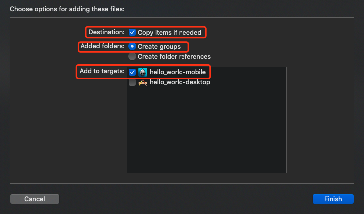

# React Native 集成指南

## 1. 概述 

本文档是介绍TopOn SDK 在React Native的集成方法，从申请账号、appid、广告位id及集成SDK进行描述，确保开发者能够顺利集成 SDK进行变现。目前TopOn SDK的React Native平台支持的广告形式如下：

| 广告形式 | 说明 |
| ---- | ---- |
| Video | 视频广告，带有UI |
| Interstitial | 插屏广告，带有UI |
| Banner | 横幅广告，带有UI |

开发者可以根据应用的形态选择合适的广告形式，具体集成方法见下面具体介绍。

## 2. 账号及相关ID准备

你可以通过<a href="https://docs.toponad.com/#/zh-cn/reactnative/GetStarted/TopOn_Get_Started" target="_blank">TopOn账号及相关ID准备</a>进行账号注册及登录的操作指引


## 3. SDK导入说明

### 3.1 将TopOnSDK添加至您的项目

**AnyThinkSDK：** React Native版本你可从TopOn商务或者运营处<a href="https://docs.toponad.com/#/zh-cn/reactnative/reactnative_doc/release_note" target="_blank">获取SDK</a> **（注意：React Native SDK 需搭配Android或者iOS的 SDK进行使用）**，TopOnSDK包含的文件说明：**（需将以下说明的JS文件导入到您的项目工程使用）**<br>

**压缩包一级目录说明：**<br>

| 文件夹 | 描述 |
| ---- | ---- |
| Android | 集成Android平台需要的SDK包|
| iOS | 集成iOS平台需要的SDK包 |
| Android_iOS | 集成Android+iOS平台需要的SDK包 |

**平台目录的说明：**

| 文件夹／文件名 | 描述 |
| ---- | ---- |
| Scipt | React Native项目中需要引入的JS代码文件 |
| bridge/iOS | Xcode工程的bridge代码文件，需要引入到您的Xcode工程 |
| bridge/Andorid | Android Studio工程bridge代码文件，分别提供了bridge的源码（source目录）以及aar包（library目录），可按需要选择使用在您的Android工程 |

**注意：进行以下步骤前，请开发者配置好React Native所必需的环境**

#### 3.1.1 Android导入说明

1. 在SDK的压缩包里选择Android平台下的anythink_reactnativejs_bridge.aar包放到项目工程libs目录下，并通过build.gradle进行引入

   ```
   dependencies {
   	api fileTree(include: ['*.jar','*.aar'], dir: 'libs')
   }
   ```

   也可选择源码的方式，将源码放置在项目的src/main/java目录下，此时需要额外配置混淆规则：

   ```
   -keep public class com.anythink.reactnativejs.**
   -keepclassmembers class com.anythink.reactnativejs.** {
      public *;
   }
   ```
   然后在Application中添加以下代码：

   ```
   public class MainApplication extends Application implements ReactApplication {
   
     private final ReactNativeHost mReactNativeHost =
         new ReactNativeHost(this) {
           ···
           @Override
           protected List<ReactPackage> getPackages() {
             List<ReactPackage> packages = new PackageList(this).getPackages();
             // Packages that cannot be autolinked yet can be added manually here, for example:
             // packages.add(new MyReactNativePackage());
             packages.add(new ATReactNativeBridgePackage());//添加此行代码
             return packages;
           }
           ···
         };
   
     @Override
     public ReactNativeHost getReactNativeHost() {
       return mReactNativeHost;
     }
   }
   ```

2. 请至TopOn<a href="https://docs.toponad.com/#/zh-cn/android/download/package" target="_blank">官网下载页面</a>，勾选需要集成的平台，点击下载；下载完成后，解压下载所得的压缩包。具体引入说明可查看<a href="https://docs.toponad.com/#/zh-cn/android/android_doc/android_access_doc?id=_2-topon-sdk%e7%9a%84%e9%9b%86%e6%88%90%e8%af%b4%e6%98%8e" target="_blank">Android原生SDK集成说明</a>**(里面已经有说明libs包的引入，AndroidManifest，以及项目相关的配置，需要按照原生集成文档来引入SDK包)**。


#### 3.1.2 iOS平台导入说明

1. 把**iOSReactNativeBridge**文件夹(在我们发布的 demo工程中可以找到)拖到xcode左边的文件列表中，在弹出的对话框中作如下选择（如图所示）：<br>
1) **Destination**选项勾选**Copy items if needed**<br>
2) **Added Folders**选项勾选**Create groups**<br>
3）**Add to targets**勾选需要添加的target<br>

2. 请至TopOn<a href="https://docs.toponad.com/#/zh-cn/ios/download/package" target="_blank">官网下载页面</a>，勾选需要集成的平台，点击下载；下载完成后，解压下载所得的压缩包，并把所得内容全部拖到xcode中即可（如图）：

图片所示为勾选了穿山甲及广点通（即腾讯优量汇）
3. 请确保下载的 SDK 版本在 **5.7.0** 以上。
4. 配置好 ReactNative 环境后，cd 到工程根目录（即包含 package.json 文件的目录），执行命令 **npm install** 安装node_modules。
5. 安装成功后打开 iOS 工程目录（即包含 Podfile 文件的目录，没有则参考 demo工程里的 Podfile ），执行命令 **pod install** 。
6. 运行项目。
7. 相关编译错误解决方式请参考<a href="https://docs.toponad.com/#/zh-cn/ios/ios_doc/ios_errorcode" target="_blank">FAQ</a> ；如有其它问题请随时联系我们。

## 4. SDK初始化

您可以通过以下代码初始化 **AnyThinkSDK** ，详细参考[demo project](https://github.com/anythinkteam/demo_reactnative):

```java
//JS导入AnyThink SDK
import {
    ATRNSDK
} from './AnyThinkAds/ATReactNativeSDK';

....

//开启SDK的Debug log，强烈建议在测试阶段开启，方便排查问题
ATRNSDK.setLogDebug(true);

//获取SDK的版本
ATRNSDK.getSDKVersionName().then(versionName => {
    console.log('TopOn SDK version name: ' + versionName);
});

//只针对Android
if (Platform.OS === 'android') {
    //判断是否是中国版SDK
    ATRNSDK.isChinaSDK().then(isChinaSDK => {
        console.log('isChinaSDK: ' + isChinaSDK);
    });
}

//针对交叉推广设置排除包名的列表，被排除的包名所对应的产品不会再被推广
ATRNSDK.setExcludeMyOfferPkgList(
    [
        "com.exclude.myoffer1",
        "com.exclude.myoffer2",
    ]
);
    
var customMap = {
    "appCustomKey1": "appCustomValue1",
    "appCustomKey2" : "appCustomValue2"
};
//设置自定义的Map信息，可匹配后台配置的广告商顺序的列表（App纬度）（可选配置）
ATRNSDK.initCustomMap(customMap);

var customPlacementId = "";
if (cc.sys.os === cc.sys.OS_IOS) {   
    customPlacementId = "b5b72b21184aa8";
} else if (cc.sys.os === cc.sys.OS_ANDROID) {
    customPlacementId = "b5b449fb3d89d7";
}

var placementCustomMap = {
    "placementCustomKey1": "placementCustomValue1",
    "placementCustomKey2" : "placementCustomValue2"
};
//设置自定义的Map信息，可匹配后台配置的广告商顺序的列表（Placement纬度）（可选配置）
ATRNSDK.setPlacementCustomMap(customPlacementId, placementCustomMap);

// 设置GDPR的等级：
// ATRNSDK.PERSONALIZED（允许上报个人信息）
// ATRNSDK.NONPERSONALIZED（不允许上报个人信息）
// ATRNSDK.setGDPRLevel(ATRNSDK.PERSONALIZED); 

// 获取GDPR等级
var GDPRLevel = ATRNSDK.getGDPRLevel();

// 初始化SDK
ATRNSDK.initSDK("a5aa1f9deda26d", "4f7b9ac17decb9babec83aac078742c7");

// 针对欧盟地区初始化时做的处理
ATRNSDK.getUserLocation().then(userLocation => {
    console.log('userLocation: ' + userLocation);
    //如果处于欧盟地区且等级是UNKNOW时，就执行授权弹窗
    if (userLocation == ATRNSDK.kATUserLocationInEU) {
        console.log('userLocation: in EU');
        ATRNSDK.getGDPRLevel().then((level) => {
            console.log('gdpr level: ' + level);
            if (level == ATRNSDK.UNKNOWN) {
                ATRNSDK.showGDPRAuth();
            }
        })
    } else {
        console.log('userLocation: not in EU');
    }
})

```


## 5. 激励视频广告

**激励广告SDK的导入：**

```java
import {
    ATRewardedVideoRNSDK
} from './AnyThinkAds/ATReactNativeSDK';
```

### 5.1 加载激励视频

使用以下代码加载激励视频广告: <p id='loading_rv'></p>

```JavaScript
var setting = {};
//如果需要通过开发者的服务器进行奖励的下发（部分广告平台支持服务器激励），则需要传递下面两个key
//ATRewardedVideoRNSDK.userIdKey必传，用于标识每个用户;ATRewardedVideoRNSDK.userDataKey为可选参数，传入后将透传到开发者的服务器
settings[ATRewardedVideoRNSDK.userIdKey] = "test_user_id";
settings[ATRewardedVideoRNSDK.userDataKey] = "test_user_data";
ATRewardedVideoRNSDK.loadAd(this.rewardedVideoPlacementId, settings);
```

**注:** 请参阅下文，了解如何获得有关激励视频广告事件的通知（加载成功/失败，展示，点击，视频开始/结束和激励）。

### 5.2 判断是否有广告缓存以及获取广告状态

使用以下代码判断是否有广告缓存：

```
ATRewardedVideoRNSDK.hasAdReady(this.rewardedVideoPlacementId);
```

使用以下代码获取广告状态（返回值类型为Json字符串）：

```
ATRewardedVideoRNSDK.checkAdStatus(this.rewardedVideoPlacementId);
```

广告状态Json字符串key-value如下：

1、**isLoading**：是否正在加载

2、**isReady**：是否有广告缓存

3、**adInfo**：当前优先级最高的广告缓存信息

### 5.3 展示激励视频

与展示原生广告相比，展示激励视频要简单得多，只要调用展示api并传递展示广告位ID或者广告位ID+场景ID**（场景ID可通过TopOn后台创建）**作为参数：

```JavaScript
ATRewardedVideoRNSDK.showAd(this.rewardedVideoPlacementId);

//使用场景功能时，通过此api进行展示
//ATRewardedVideoRNSDK.showAdInScenario(this.rewardedVideoPlacementId, this.rewardedVideoScenarioId);
```

### 5.4 实现激励视频的监听器
可查看下面的示例代码 **（全局只能设置一个监听对象，可通过event.placementId 获取此事件对应的广告位ID，event.adCallbackInfo获取此事件的callbackInfo，event.errorMsg获取错误信息）**：

```JavaScript
//广告加载成功
ATRewardedVideoRNSDK.setAdListener(ATRewardedVideoRNSDK.onRewardedVideoLoaded, (event) => {
	console.log('ATRewardedVideoLoaded: ' + event.placementId);
});
//广告加载失败
ATRewardedVideoRNSDK.setAdListener(ATRewardedVideoRNSDK.onRewardedVideoFail, (event) => {
    console.warn('ATRewardedVideoLoadFail: ' + event.placementId + ', errorMsg: ' + event.errorMsg);
});
//广告开始播放
ATRewardedVideoRNSDK.setAdListener(ATRewardedVideoRNSDK.onRewardedVideoPlayStart, (event) => {
    console.log('ATRewardedVideoPlayStart: ' + event.placementId + ', adCallbackInfo: ' + event.adCallbackInfo);
});
//广告播放结束
ATRewardedVideoRNSDK.setAdListener(ATRewardedVideoRNSDK.onRewardedVideoPlayEnd, (event) => {
    console.log('ATRewardedVideoPlayEnd: ' + event.placementId + ', adCallbackInfo: ' + event.adCallbackInfo);
});
//广告播放失败
ATRewardedVideoRNSDK.setAdListener(ATRewardedVideoRNSDK.onRewardedVideoPlayFail, (event) => {
    console.log('ATRewardedVideoPlayFail: ' + event.placementId + ', errorMsg: ' + event.errorMsg + ', adCallbackInfo: ' + event.adCallbackInfo);
});
//广告被点击
ATRewardedVideoRNSDK.setAdListener(ATRewardedVideoRNSDK.onRewardedVideoClick, (event) => {
    console.log('ATRewardedVideoClick: ' + event.placementId + ', adCallbackInfo: ' + event.adCallbackInfo);
});
//激励成功，开发者可在此回调中下发奖励，一般先于onRewardedVideoAdClosed回调，服务器激励则不一定
ATRewardedVideoRNSDK.setAdListener(ATRewardedVideoRNSDK.onRewardedVideoReward, (event) => {
    console.log('ATRewardedVideoReward: ' + event.placementId + ', adCallbackInfo: ' + event.adCallbackInfo);
});
//广告被关闭
ATRewardedVideoRNSDK.setAdListener(ATRewardedVideoRNSDK.onRewardedVideoClose, (event) => {
    console.log('ATRewardedVideoClose: ' + event.placementId + ', adCallbackInfo: ' + event.adCallbackInfo);
});
```

**注意：** 可查看Demo的**App.js** [demo project](https://github.com/anythinkteam/demo_reactnative).

### 5.5 移除激励视频的监听器

在不需要的时候，可移除事件监听

```
ATRewardedVideoRNSDK.removeAllListeners();
```


## 6. 插屏广告

**插屏广告SDK的导入：**

```java
import {
    ATInterstitialRNSDK
} from './AnyThinkAds/ATReactNativeSDK';
```

### 6.1 加载插屏广告

使用以下代码加载插屏广告

```JavaScript
//只针对Sigmob平台，Sigmob的激励视频广告源当做插屏使用
var settings = {};
//settings[ATInterstitialRNSDK.UseRewardedVideoAsInterstitial] = true;
settings[ATInterstitialRNSDK.UseRewardedVideoAsInterstitial] = false;

ATInterstitialRNSDK.loadAd(this.interstitialPlacementId, settings);
```

**注:** 请参阅下文，了解如何获得有关插屏广告事件的通知（加载成功/失败，展示，点击，视频开始/结束）。

### 6.2 判断是否有广告缓存以及获取广告状态

使用以下代码判断是否有广告缓存：

```
ATInterstitialRNSDK.hasAdReady(this.interstitialPlacementId);
```

使用以下代码获取广告状态（返回值类型为Json字符串）：

```
ATInterstitialRNSDK.checkAdStatus(this.interstitialPlacementId);
```

广告状态Json字符串key-value如下：

1、**isLoading**：是否正在加载

2、**isReady**：是否有广告缓存

3、**adInfo**：当前优先级最高的广告缓存信息

### 6.3 展示插屏广告

与激励视频相同，插屏广告只要调用展示api并传递展示广告位ID或者广告位ID+场景ID**（场景ID可通过TopOn后台创建）**作为参数：

```JavaScript
ATInterstitialRNSDK.showAd(this.interstitialPlacementId);

//使用场景功能时，通过此api进行展示
//ATInterstitialRNSDK.showAdInScenario(this.interstitialPlacementId, this.interstitialScenarioId);
```

### 6.4 实现插屏的监听器

有关插屏广告事件的通知示例如下**（全局只能设置一个监听对象，可通过event.placementId 获取此事件对应的广告位ID，event.adCallbackInfo获取此事件的callbackInfo，event.errorMsg获取错误信息）**：

```JavaScript
//广告加载成功
ATInterstitialRNSDK.setAdListener(ATInterstitialRNSDK.onInterstitialLoaded, (event) => {
    console.log('ATInterstitialLoaded: ' + event.placementId);
});
//广告加载失败
ATInterstitialRNSDK.setAdListener(ATInterstitialRNSDK.onInterstitialFail, (event) => {
    console.warn('ATInterstitialLoadFail: ' + event.placementId + ', errorMsg: ' + event.errorMsg);
});
//广告展示成功
ATInterstitialRNSDK.setAdListener(ATInterstitialRNSDK.onInterstitialAdShow, (event) => {
    console.log('ATInterstitialAdShow: ' + event.placementId + ', adCallbackInfo: ' + event.adCallbackInfo);
});
//广告视频开始播放，部分平台有此回调
ATInterstitialRNSDK.setAdListener(ATInterstitialRNSDK.onInterstitialPlayStart, (event) => {
    console.log('ATInterstitialPlayStart: ' + event.placementId + ', adCallbackInfo: ' + event.adCallbackInfo);
});
//广告视频播放结束，部分广告平台有此回调
ATInterstitialRNSDK.setAdListener(ATInterstitialRNSDK.onInterstitialPlayEnd, (event) => {
    console.log('ATInterstitialPlayEnd: ' + event.placementId + ', adCallbackInfo: ' + event.adCallbackInfo);
});
//广告视频播放失败，部分广告平台有此回调
ATInterstitialRNSDK.setAdListener(ATInterstitialRNSDK.onInterstitialPlayFail, (event) => {
    console.log('ATInterstitialPlayFail: ' + event.placementId + ', errorMsg: ' + event.errorMsg + ', adCallbackInfo: ' + event.adCallbackInfo);
});
//广告被点击
ATInterstitialRNSDK.setAdListener(ATInterstitialRNSDK.onInterstitialClick, (event) => {
    console.log('ATInterstitialClick: ' + event.placementId + ', adCallbackInfo: ' + event.adCallbackInfo);
});
//广告被关闭
ATInterstitialRNSDK.setAdListener(ATInterstitialRNSDK.onInterstitialClose, (event) => {
    console.log('ATInterstitialClose: ' + event.placementId + ', adCallbackInfo: ' + event.adCallbackInfo);
});
```

**注意：** 可查看Demo的**App.js** [demo project](https://github.com/anythinkteam/demo_reactnative).

### 6.5 移除插屏的监听器

在不需要的时候，可移除事件监听

```
ATInterstitialRNSDK.removeAllListeners();
```

## 7. 横幅广告

**Banner广告SDK的导入：**

```java
import {
    ATBannerRNSDK
} from './AnyThinkAds/ATReactNativeSDK';
```

### 7.1 加载横幅广告

使用以下代码加载Banner广告

```JavaScript
var settings = {};
if (Platform.OS === 'android') {
  settings[ATBannerRNSDK.kATBannerAdLoadingExtraBannerAdSizeStruct] = ATBannerRNSDK.createLoadAdSize(this.deviceWidthInPixel, this.deviceWidthInPixel * 50/320);
  
  //只针对Admob的自适应banner
  settings[ATBannerRNSDK.kATBannerAdAdaptiveWidth] = this.deviceWidthInPixel;
  settings[ATBannerRNSDK.kATBannerAdAdaptiveOrientation] = ATBannerRNSDK.kATBannerAdAdaptiveOrientationCurrent;
//    settings[ATBannerRNSDK.kATBannerAdAdaptiveOrientation] = ATBannerRNSDK.kATBannerAdAdaptiveOrientationPortrait;
//    settings[ATBannerRNSDK.kATBannerAdAdaptiveOrientation] = ATBannerRNSDK.kATBannerAdAdaptiveOrientationLandscape;
} 
else if (Platform.OS === 'ios') {
  // banner size 传入以pt单位为准
  settings[ATBannerRNSDK.kATBannerAdLoadingExtraBannerAdSizeStruct] = ATBannerRNSDK.createLoadAdSize(320, 50);
  
  //只针对Admob的自适应banner
  settings[ATBannerRNSDK.kATBannerAdAdaptiveWidth] = 320;
  settings[ATBannerRNSDK.kATBannerAdAdaptiveOrientation] = ATBannerRNSDK.kATBannerAdAdaptiveOrientationCurrent;
//    settings[ATBannerRNSDK.kATBannerAdAdaptiveOrientation] = ATBannerRNSDK.kATBannerAdAdaptiveOrientationPortrait;
//    settings[ATBannerRNSDK.kATBannerAdAdaptiveOrientation] = ATBannerRNSDK.kATBannerAdAdaptiveOrientationLandscape;
}

ATBannerRNSDK.loadAd(this.bannerPlacementId, settings);
```

**ATBannerRNSDK.createLoadAdSize(width, height)函数说明：**

- width：Banner展示区域的宽度
- height：Banner展示区域的高度

**注意：**加载Banner广告时必须传入改参数设置，否则会出现Banner不能达到预期展示效果。


请继续阅读以了解如何获得有关Banner广告事件的通知，例如加载成功/失败，展示和点击。

### 7.2 展示横幅广告

目前可以用两种方法来展示banner广告。

#### 7.2.1 用预定义的位置来展示横幅广告

1）把banner展示在屏幕顶部

```JavaScript
ATBannerRNSDK.showAdInPosition(this.bannerPlacementId, ATBannerRNSDK.kATBannerAdShowingPositionTop)
```

2）把banner展示在屏幕底部

```JavaScript
ATBannerRNSDK.showAdInPosition(this.bannerPlacementId, ATBannerRNSDK.kATBannerAdShowingPositionBottom);
```
当使用预定义位置来展示banner广告的时候，AnyThinkSDK已经考虑了刘海屏等Safe Area相关空白区域了。

#### 7.2.2 用位置和宽高属性来展示横幅广告

```JavaScript
ATBannerRNSDK.showAdInRectangle(this.bannerPlacementId,  ATBannerRNSDK.createShowAdRect(0, 0, this.deviceWidthInPixel, this.deviceWidthInPixel  * 50/320))
```

**ATBannerRNSDK.createShowAdRect(x, y, width, height)**函数说明：<br>
（1）x:横坐标位置（以左上角为原点）<br>
（2）y:纵坐标位置（以左上角为原点）<br>
（3）width: 宽度 <br>
（4）height: 高度 <br>

##### 关于宽高的设置

通过使用 **Dimensions.get('window').width * Dimensions.get('window').scale** 或者**Dimensions.get('window').height * Dimensions.get('window').scale** 来获取屏幕的宽高像素值，尽量通过使用宽高比来进行元素的位置以及宽高的设置，避免固定像素导致在其他手机出现变形，具体可参考Demo。


如果需要，请使用以下代码从屏幕上**移除**Banner：

```JavaScript
ATBannerRNSDK.removeAd(this.bannerPlacementId);
```

如果您只想**暂时隐藏** Banner（而不是**从屏幕上移除**），请在此处使用代码：

```JavaScript
ATBannerRNSDK.hideAd(this.bannerPlacementId);
```

隐藏Banner后，可以使用以下代码重新显示它：

```JavaScript
ATBannerRNSDK.reShowAd(this.bannerPlacementId);
```


### 7.3 实现横幅的监听器

要获得有关各种Banner广告事件（加载成功/失败，展示和点击）的通知，示例代码如下**（全局只能设置一个监听对象，可通过event.placementId 获取此事件对应的广告位ID，event.adCallbackInfo获取此事件的callbackInfo，event.errorMsg获取错误信息）**：

```JavaScript
//广告加载成功
ATBannerRNSDK.setAdListener(ATBannerRNSDK.onBannerLoaded, (event) => {
    console.log('ATBannerLoaded: ' + event.placementId);
});
//广告加载失败
ATBannerRNSDK.setAdListener(ATBannerRNSDK.onBannerFail, (event) => {
    console.warn('ATBannerLoadFail: ' + event.placementId + ', errorMsg: ' + event.errorMsg);
});
//广告展示成功
ATBannerRNSDK.setAdListener(ATBannerRNSDK.onBannerShow, (event) => {
    console.log('ATBannerShow: ' + event.placementId + ', adCallbackInfo: ' + event.adCallbackInfo);
});
//广告关闭按钮被点击
ATBannerRNSDK.setAdListener(ATBannerRNSDK.onBannerCloseButtonTapped, (event) => {
    console.log('ATBannerCloseButtonTapped: ' + event.placementId + ', adCallbackInfo: ' + event.adCallbackInfo);
});
//广告被点击
ATBannerRNSDK.setAdListener(ATBannerRNSDK.onBannerClick, (event) => {
    console.log('ATBannerClick: ' + event.placementId + ', adCallbackInfo: ' + event.adCallbackInfo);
});
//广告自动刷新成功
ATBannerRNSDK.setAdListener(ATBannerRNSDK.onBannerRefresh, (event) => {
    console.log('ATBannerRefresh: ' + event.placementId + ', errorMsg: ' + event.errorMsg + ', adCallbackInfo: ' + event.adCallbackInfo);
});
//广告自动刷新失败
ATBannerRNSDK.setAdListener(ATBannerRNSDK.onBannerRefreshFail, (event) => {
    console.log('ATBannerRefreshFail: ' + event.placementId + ', adCallbackInfo: ' + event.adCallbackInfo);
});
```

**注意：** 可查看Demo的**App.js** [demo project](https://github.com/anythinkteam/demo_reactnative).

### 7.4 移除横幅的监听器

在不需要的时候，可移除事件监听

```
ATBannerRNSDK.removeAllListeners();
```

## 8. 开屏广告

强烈建议使用Xcode/Android Studio中的原生API（Objective-C / Java）来接入，有关如何使用Objective-C / Java集成开屏广告的更多信息，请参考TopOn SDK集成说明文档

| 系统平台| 说明|
|---|---|
|TopOn Android SDK|<a href="#/zh-cn/android/android_doc/android_access_doc.md" target = "_blank">查看</a>|
|TopOn iOS SDK|<a href="#/zh-cn/ios/ios_doc/ios_access_doc.md" target = "_blank">查看</a> |

## 9. 广告事件回调的callbackInfo内容说明

| 变量                       | 类型    | 说明                                                         |
| -------------------------- | ------- | ------------------------------------------------------------ |
| network_firm_id            | int     | 获取 广告平台对应的ID，用于区分广告平台                      |
| adsource_id                | string     | 获取 广告源ID. 可在开发者后台或TopOn Open API 通过广告源ID查询具体的Network信息 |
| adsource_index             | int     | 获取 当前广告源在WaterFall中的排序**（从0开始）**            |
| adsource_price             | dounble | 获取 ECPM，单位可通过getCurrency()获取                       |
| adsource_isheaderbidding   | int     | 是否为头部竞价的广告源，**1：是，2：否**                     |
| id                         | int     | 获取 每次**展示广告**时生成的独立ID                          |
| publisher_revenue          | double  | 获取 展示收益                                                |
| currency                   | string  | 获取 货币单位，例如："USD"                                   |
| country                    | string  | 获取 国家代码， 例如：”CN"                                   |
| adunit_id                  | string  | 获取 TopOn广告位ID                                           |
| adunit_format              | string  | 获取 广告类型，包括：**"Native"、"RewardedVideo"、"Banner"<br>"Interstitial"、"Splash"** |
| precision                  | string  | 获取 ECPM精度<br>**"publisher_defined"**：开发者在TopOn后台为广告源定义的eCPM**（交互推广的eCPM也属于该类型)**<br>**"estimated":** TopOn的预估eCPM（auto eCPM)<br>**"exact"**：Header Bidding实时竞价的eCPM |
| network_type               | string  | 获取 Network类型<br>**"Network"**：第三方广告平台<br>**"Cross_Promotion"**：交互推广<br>**"Adx"**：暂未支持 |
| network_placement_id       | string  | 获取 Network的广告位ID                                       |
| ecpm_level                 | int     | 获取 广告源的eCPM层级，**头部竞价广告源默认为0**             |
| segment_id                 | int     | 获取 流量分组ID                                              |
| scenario_id                | string  | 获取 广告场景ID，**仅Rewarded Video&Interstitial支持**       |
| scenario_reward_name       | string  | 获取 广告场景的激励名称，**仅Rewarded Video支持**            |
| scenario_reward_number     | int     | 获取 广告场景的激励数量，**仅Rewarded Video支持**            |
| sub_channel                | string  | 获取子渠道信息                                               |
| channel                    | string  | 获取 渠道信息                                                |
| custom_rule                | Dictionary<string,object>  | 获取 **Placement+App维度**的自定义规则的**Json字符串**       |
| getOriginJSONString()      | string  | 原始的JSON字符串信息     |

TopOn平台的**NETWORK FIRM ID**对应Network名称

| Network Name| NETWORK FIRM ID|
|---|---|
|Facebook | 1 |
|Admob | 2 |
|Inmobi | 3 |
|Flurry| 4 |
|Applovin| 5 |
|Mintegral | 6 |
|Mopub | 7 |
|GDT | 8|
|Chartboost | 9|
|Tapjoy | 10 |
|Ironsource | 11|
|UnityAds | 12 |
|Vungle | 13 |
|Adcolony | 14 |
|TouTiao|15|
|玩转互联 | 16 |
|Oneway|17|
|金山云 | 19 |
|Appnext|21|
|Baidu|22|
|Nend|23|
|Maio|24|
|StartApp |25|
|SuperAwesome |26|
|快手|28|
|Sigmob |29|
|Ogury |36|
|Fyber|37|
|Huawei|39|

